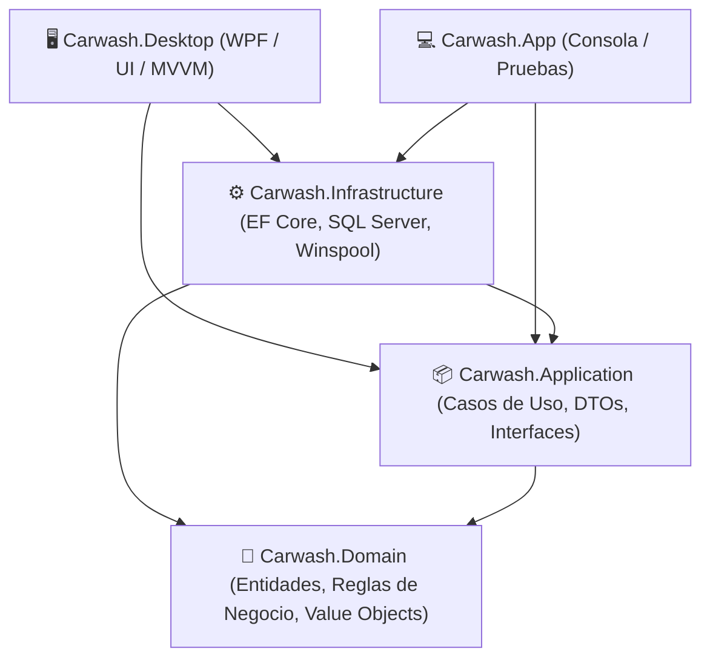

# Mi Carwash Punto de venta (WPF + .NET 10)

[](https://dotnet.microsoft.com/)
[](https://github.com/lepoco/wpfui)
[](https://learn.microsoft.com/ef/core/)
[](https://blog.cleancoder.com/)
[-orange)](#-soporte-de-impresora-térmica)

Sistema de escritorio punto de venta (POS) de alto rendimiento para negocios integrados de **Lavado de Vehículos + Bar/Cafetería**. Diseñado bajo **Clean Architecture**, **Domain-Driven Design (DDD)** y principios **SOLID**, optimizado para operaciones locales rápidas, control de caja y emisión ágil de comprobantes térmicos.

---

## 📋 Tabla de Contenidos

- [Características Principales](#-características-principales)
- [Arquitectura de la Solución](#-arquitectura-de-la-solución)
- [Stack Tecnológico](#-stack-tecnológico)
- [Módulos del Sistema](#-módulos-del-sistema)
- [Soporte de Impresora Térmica](#-soporte-de-impresora-térmica)
- [Primeros Pasos](#-primeros-pasos)
  - [Requisitos Previos](#requisitos-previos)
  - [Instalación y Ejecución](#instalación-y-ejecución)
  - [Credenciales por Defecto](#credenciales-por-defecto)
- [Estructura del Proyecto](#-estructura-del-proyecto)
- [Base de Datos y Migraciones](#-base-de-datos-y-migraciones)
- [Licencia](#-licencia)

---

## ✨ Características Principales

- **⚡ Punto de Venta Dinámico**: Registro ágil de ventas tanto para servicios de lavado (clasificados por tipo de vehículo) como para consumos del bar (bebidas, snacks con control de inventario).
- **⏱️ Flujo de Tickets Pendientes (Paga al Retirar)**: Permite ingresar vehículos a lavado generando el ticket de control y cobrarlos al momento de la entrega.
- **🚿 Asignación de Lavadores por Detalle**: Control exacto de comisiones o asignación de trabajo por servicio y operario.
- **💵 Cuadre y Cierre de Caja en Vivo**: Resumen diario en tiempo real discriminando ingresos en **Efectivo** vs. **Transferencias**, total de tickets cobrados y pendientes por cobrar.
- **🖨️ Impresión Térmica Directa (RAW Winspool)**: Integración nativa con impresoras Epson TM-T20II (ESC/POS de 80mm / 42 columnas) mediante `winspool.drv` con soporte de corte automático y copias de auditoría en texto y binario.
- **🔒 Seguridad y Autenticación**: Control de acceso mediante usuarios, contraseñas hasheadas (`SHA-256` con salt) y administración de roles.
- **🎨 Interfaz Moderna Fluent**: Diseñada en WPF con Fluent UI, responsive, amigable con pantallas táctiles y navegación intuitiva.

---

## 🏛️ Arquitectura de la Solución

El sistema implementa **Clean Architecture** para garantizar desacoplamiento, testabilidad y mantenibilidad:



- **`Carwash.Domain`**: Núcleo empresarial independiente de frameworks. Contiene entidades ricas (`Ticket`, `Caja`, `Lavador`, `ProductoServicio`, `Usuario`, `Negocio`), reglas invariantes y resultados tipados (`Result<T>`).
- **`Carwash.Application`**: Casos de uso de la aplicación (`CrearTicket`, `AnularTicket`, `MarcarPagado`, `CuadreDelDia`, `GestionUsuarios`, etc.) y contratos de abstracción (`ICarwashDbContext`, `ITicketPrinter`).
- **`Carwash.Infrastructure`**: Implementación de persistencia con **Entity Framework Core**, migraciones, configuración Fluent API y el servicio de impresión nativo Win32 spooler.
- **`Carwash.Desktop`**: Capa de presentación WPF con patrón MVVM, ventanas Fluent, inyección de dependencias (`Microsoft.Extensions.DependencyInjection`) y control de sesión.

---

## 🛠️ Stack Tecnológico

| Componente | Tecnología / Librería | Propósito |
| :--- | :--- | :--- |
| **Framework** | .NET 10.0 (C# 13+) | Plataforma base de alto rendimiento |
| **Interfaz (UI)** | WPF + [WPF-UI (Fluent)](https://github.com/lepoco/wpfui) | Experiencia visual moderna estilo Windows 11 |
| **Patrón UI** | MVVM (Model-View-ViewModel) | Separación limpia de lógica y vista |
| **ORM / Datos** | Entity Framework Core 10 | Mapeo objeto-relacional y migraciones |
| **Base de Datos** | SQL Server / LocalDB (`MSSQLLocalDB`) | Almacenamiento transaccional local |
| **Impresión** | P/Invoke `winspool.drv` + ESC/POS | Envío RAW directo a impresoras térmicas USB |
| **Inyección Dep.** | `Microsoft.Extensions.DependencyInjection` | Contenedor IoC nativo |

---

## 📦 Módulos del Sistema

### 1. Ventas (POS)
- Catálogo filtrable por categorías (**Lavado**, **Bar**, etc.).
- Carrito de compra con cálculo instantáneo de totales, impuestos o descuentos.
- Selección de lavador por línea de servicio.
- Opciones de cobro: **Inmediato** (Efectivo/Transferencia con cálculo de cambio) o **Pendiente** (para cobro al retirar el vehículo).

### 2. Caja Diaria
- Resumen automático de las operaciones del día actual.
- Métricas: Total ingresado en efectivo, total por transferencia, volumen pendiente por cobrar.
- Conteo y desglose de tickets emitidos, cobrados y cancelados.

### 3. Historial de Tickets
- Listado histórico con filtros por estado (**Cobrado**, **Pendiente**, **Anulado**).
- Ver detalle completo del ticket y desglose de servicios/productos.
- Reimpresión de tickets a la impresora térmica con un clic.
- Cobro posterior de tickets pendientes y anulación justificada.

### 4. Productos y Servicios
- Gestión CRUD de servicios de lavado y consumibles de bar.
- Control de inventario para productos que requieren stock.
- Asignación de categorías y precios.

### 5. Configuración y Personalización
- Datos de cabecera del negocio (Nombre comercial, RNC/Cédula, Teléfono, Dirección) impresos en el ticket.
- Administración de Lavadores (altas, bajas y estado activo/inactivo).
- Gestión de Usuarios y cambio de contraseñas.
- Parámetros de impresión (nombre de la impresora Epson TM-T20II o genérica).

---

## 🖨️ Soporte de Impresora Térmica

El servicio `EpsonTmT20IIPrinter` está optimizado para impresoras térmicas estándar de **80mm**:

1. **Envío Directo USB**: No requiere compartir la impresora en red; se comunica a través del spooler de Windows (`winspool.drv`).
2. **Auto-Detección Inteligente**: Busca automáticamente dispositivos instalados que contengan `"EPSON"`, `"TM-T20"`, `"POS"` o `"TICKET"`.
3. **Copia de Auditoría Local**: Si la impresora no está conectada o está apagada, el sistema genera automáticamente copias de resguardo en la carpeta local de la aplicación:
   - `tickets/ticket-{id}.txt` (versión legible en texto)
   - `tickets/ticket-{id}.bin` (flujo binario ESC/POS para reimpresión)

---

## 🚀 Primeros Pasos

### Requisitos Previos

- **Sistema Operativo**: Windows 10 / Windows 11 (64-bit).
- **IDE**: [Visual Studio 2026 / 2022](https://visualstudio.microsoft.com/) (con la carga de trabajo *Desarrollo de escritorio de .NET* instalada) o [Visual Studio Code](https://code.visualstudio.com/) con C# Dev Kit.
- **SDK**: [.NET 10.0 SDK](https://dotnet.microsoft.com/download/dotnet/10.0).
- **Base de Datos**: SQL Server Express o SQL Server LocalDB (`(localdb)\MSSQLLocalDB`).

### Instalación y Ejecución

1. **Clonar el repositorio**:
   ```bash
   git clone https://github.com/luisbravobello/Carwash.git
   cd Carwash
   ```

2. **Restaurar dependencias y compilar**:
   ```bash
   dotnet restore
   dotnet build
   ```

3. **Ejecutar la aplicación**:
   - Desde la terminal:
     ```bash
     dotnet run --project src/Carwash.Desktop
     ```
   - O abriendo `Carwash.slnx` en Visual Studio y presionando <kbd>F5</kbd> (con `Carwash.Desktop` configurado como proyecto de inicio).

> [!NOTE]
> Al iniciar por primera vez, la aplicación ejecutará automáticamente las **migraciones de base de datos** pendientes en LocalDB y creará los datos semilla iniciales (categorías básicas, métodos de pago y usuario administrador).

---

### 🔑 Credenciales por Defecto

En el primer arranque, el sistema siembra automáticamente el usuario administrador:

| Usuario | Contraseña | Rol |
| :--- | :--- | :--- |
| `admin` | `1234` | Administrador |

*(Se recomienda actualizar la contraseña inmediatamente después del primer inicio en **Configuración → Usuarios**)*.

---

## 📁 Estructura del Proyecto

```text
Carwash/
├── .gitignore
├── Carwash.slnx                               # Solución XML .NET
├── README.md
└── src/
    ├── Carwash.Domain/                        # Reglas del Negocio y Entidades
    │   ├── Caja/
    │   ├── Catalogo/
    │   ├── Negocio/
    │   ├── Personal/
    │   ├── Tickets/
    │   └── Vehiculos/
    ├── Carwash.Application/                   # Casos de Uso y Servicios
    │   ├── Caja/
    │   ├── Catalogo/
    │   ├── Common/Interfaces/
    │   ├── Negocio/
    │   ├── Personal/
    │   ├── Tickets/
    │   └── Usuarios/
    ├── Carwash.Infrastructure/                # EF Core, Persistencia y Drivers
    │   ├── Persistence/
    │   │   ├── Configurations/
    │   │   └── Migrations/
    │   └── Printing/                          # Impresión RAW ESC/POS
    ├── Carwash.Desktop/                       # Interfaz Gráfica WPF Fluent
    │   ├── Seguridad/
    │   ├── ViewModels/
    │   └── Views/
    └── Carwash.App/                           # Consola auxiliar / CLI
```

---

## 🗄️ Base de Datos y Migraciones

La base de datos utiliza **Entity Framework Core** con migraciones版本adas.

Para aplicar migraciones o crear nuevas desde la terminal:

```bash
# Agregar una nueva migración
dotnet ef migrations add NombreDeLaMigracion -s src/Carwash.Desktop -p src/Carwash.Infrastructure

# Aplicar migraciones a la base de datos manualmente
dotnet ef database update -s src/Carwash.Desktop -p src/Carwash.Infrastructure
```

Cadena de conexión por defecto (en `App.xaml.cs`):
```text
Server=(localdb)\MSSQLLocalDB;Database=CarwashDB;Trusted_Connection=True;TrustServerCertificate=True
```

---

## 📄 Licencia

Este proyecto se distribuye bajo licencia privada para **Mi Carwash**. Consulta los términos de uso correspondientes con el propietario del repositorio.
